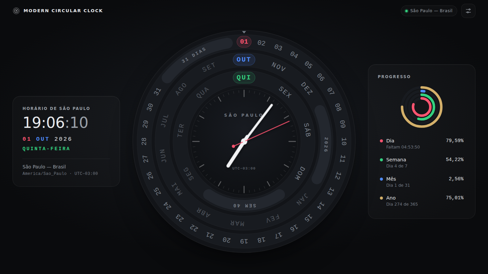

# Modern Circular Clock — São Paulo

Relógio e calendário circular para a web, organizado em **anéis concêntricos**, que mostra **sempre o horário oficial de São Paulo — Brasil** (`America/Sao_Paulo`), independentemente do país, do estado ou do fuso configurado no dispositivo que abre a página.



> Captura feita com o navegador configurado em **UTC** (22:06): a interface exibe 19:06, o horário de São Paulo no mesmo instante.

---

## Sumário

- [Descrição](#descrição)
- [Funcionalidades](#funcionalidades)
- [Horário de São Paulo](#horário-de-são-paulo)
- [Tecnologias](#tecnologias)
- [Instalação e execução](#instalação-e-execução)
- [Estrutura](#estrutura)
- [Anéis](#anéis)
- [Calendário](#calendário)
- [Cálculo dos ponteiros](#cálculo-dos-ponteiros)
- [Indicadores de progresso](#indicadores-de-progresso)
- [Configurações](#configurações)
- [Responsividade](#responsividade)
- [Acessibilidade](#acessibilidade)
- [Desempenho](#desempenho)
- [Testes](#testes)
- [GitHub Pages](#github-pages)
- [Licença](#licença)

---

## Descrição

O projeto reconstrói, de forma própria e mais completa, o conceito de um “relógio moderno” com anéis giratórios: cada anel representa uma grandeza do calendário e **gira** para que o valor atual fique sempre sob uma janela de leitura fixa no topo (12 horas). No centro há um relógio analógico com movimento contínuo, e ao lado ficam a leitura digital e os indicadores de progresso do dia, da semana, do mês e do ano.

É feito apenas com **HTML5, CSS3, JavaScript moderno (ES2021+, módulos nativos) e SVG**, sem frameworks, sem dependências de execução e sem chamadas a serviços externos.

## Funcionalidades

- **Três anéis concêntricos** (de fora para dentro): dias do mês (`01`–`31`), meses (`JAN`–`DEZ`) e dias da semana (`SEG`–`DOM`).
- Valor atual destacado em cada anel: **dia em vermelho/rosa**, **mês em azul**, **dia da semana em verde**; itens já transcorridos ficam esmaecidos.
- Os anéis **giram com animação** quando o dia, o mês ou o ano mudam em São Paulo, sempre para a frente (31 → 01, DEZ → JAN).
- O segmento livre de cada anel traz contexto: **quantidade de dias do mês**, **ano** e **semana ISO**.
- **Relógio analógico** com ponteiros de hora, minuto e segundo em movimento suave (milissegundos incluídos).
- **Relógio digital** (`19:06:10`, `01 OUT 2026`, `QUINTA-FEIRA`, `São Paulo — Brasil`, `America/Sao_Paulo · UTC−03:00`).
- **Indicadores de progresso** do dia, da semana, do mês e do ano, com frações exatas.
- **Tooltips** ao passar o mouse, tocar ou navegar pelo teclado (ex.: “1 de outubro de 2026 · Quinta-feira · Hoje”, “274º dia do ano · 91 dias restantes”).
- **Animação de abertura** de ~1,5 s: fundo → estrutura → anéis girando até a posição → mostrador → ponteiros → tempo real.
- **Configurações**: tema escuro/claro, 24 h/12 h, Português/English, mostrar/ocultar segundos e indicadores, salvas em `localStorage`.
- Atualização contínua: trocas de minuto, hora, dia, mês e ano acontecem **sem recarregar a página**.

## Horário de São Paulo

Toda a aplicação usa **`America/Sao_Paulo`** como zona de referência. O fuso do dispositivo **não altera** a zona exibida, e não existe opção para trocá-la.

### Como funciona

1. **O instante** vem do relógio do dispositivo (`Date.now()`): um número absoluto de milissegundos desde 1970 (UTC), que é o mesmo em qualquer fuso.
2. **A conversão** para data e hora civis é feita por um único módulo, [`js/sao-paulo-time.js`](js/sao-paulo-time.js), com `Intl.DateTimeFormat` fixado em `timeZone: "America/Sao_Paulo"`:

   ```js
   const formatter = new Intl.DateTimeFormat('en-US', {
     timeZone: 'America/Sao_Paulo',
     calendar: 'gregory',
     numberingSystem: 'latn',
     hourCycle: 'h23',
     year: 'numeric', month: 'numeric', day: 'numeric',
     hour: 'numeric', minute: 'numeric', second: 'numeric',
   });
   ```

3. **`getSaoPauloDateTime()`** devolve tudo o que o restante do sistema precisa: `year`, `month`, `day`, `hours`, `minutes`, `seconds`, `milliseconds`, dia da semana, semana ISO, dia do ano, dias do mês e do ano, ano bissexto e deslocamento UTC atual.
4. **Nenhum outro módulo lê a data por conta própria.** Ponteiros, anéis, leitura digital, progresso e tooltips consomem o mesmo objeto, então não há como partes diferentes usarem fusos diferentes. O código não usa `getHours()`, `getDate()`, `getDay()` nem `getTimezoneOffset()`.

### O que isso garante

- Abrindo a página no Japão às 03:25 de sexta-feira, a interface mostra **15:25 de quinta-feira**, porque é esse o horário em São Paulo.
- Trocas de dia, mês e ano seguem a **meia-noite de São Paulo**, não a do dispositivo.
- Se o Brasil voltar a adotar horário de verão, os navegadores atualizados receberão a nova regra pelo banco de fusos IANA, e a aplicação acompanhará automaticamente. Os cálculos de progresso usam os limites reais de cada período, então um dia de 23 h ou 25 h também é medido corretamente.
- Se um navegador não conseguir calcular `America/Sao_Paulo`, a página mostra uma mensagem explicativa em vez de usar outro fuso silenciosamente.

### Limitações honestas

- O navegador **não tem acesso independente a um relógio atômico**. O instante atual depende do relógio do sistema operacional, que normalmente é sincronizado por NTP. Se o relógio do dispositivo estiver adiantado ou atrasado, a hora exibida terá o mesmo erro. O **fuso**, porém, estará sempre certo.
- Uma sincronização externa opcional (por exemplo, com um servidor de horário) poderia ser adicionada no futuro como uma fonte alternativa em [`js/time-source.js`](js/time-source.js), sem que o funcionamento principal dependa dela.

## Tecnologias

| Tecnologia | Uso |
| --- | --- |
| HTML5 | Estrutura semântica, `<dialog>`, `<time datetime>` |
| CSS3 | Custom properties (temas), Grid, Flexbox, `clamp()`/`min()`/`max()`, container queries, `dvh`, `prefers-reduced-motion`, `forced-colors` |
| JavaScript ES2021+ | Módulos nativos, classes, `Intl.DateTimeFormat`, `Intl.NumberFormat`, `requestAnimationFrame` |
| SVG | Anéis, mostrador, ponteiros e indicadores de progresso |
| Node.js `node:test` | Testes automatizados (sem dependências) |

Não há React, Angular, Vue, jQuery nem qualquer pacote npm. O `package.json` serve apenas para os scripts de teste.

## Instalação e execução

Não há nada para instalar. Como o projeto usa **módulos ES**, ele precisa ser servido por HTTP (abrir o `index.html` direto pelo sistema de arquivos, via `file://`, é bloqueado pelos navegadores).

```bash
git clone https://github.com/Helio965/Modern-Web-Clock.git
cd Modern-Web-Clock

# Opção 1 — Python 3
python -m http.server 8000      # ou: python3 -m http.server 8000

# Opção 2 — Node.js
npx serve .
```

Depois, abra `http://localhost:8000` (ou o endereço indicado pelo `serve`).

## Estrutura

```text
/
├── index.html              Página única (estrutura, SVG do mostrador, diálogo de configurações)
├── css/
│   ├── style.css           Tokens de design, temas, layout base, painéis, diálogo, tooltip
│   ├── clock.css           Mostrador, anéis, ponteiros e animação de abertura
│   └── responsive.css      Layouts por tamanho de tela, movimento reduzido, alto contraste
├── js/
│   ├── sao-paulo-time.js   Núcleo temporal: única fonte de data/hora (America/Sao_Paulo)
│   ├── time-source.js      Origem do instante: relógio real ou simulação via URL
│   ├── app.js              Inicialização e laço de renderização (requestAnimationFrame)
│   ├── calendar.js         Anéis de dias do mês, meses e dias da semana
│   ├── clock.js            Ponteiros analógicos e leitura digital
│   ├── progress.js         Indicadores de progresso (dia, semana, mês, ano)
│   ├── settings.js         Preferências do usuário (localStorage)
│   ├── tooltip.js          Conteúdo dos tooltips e exploração por teclado
│   └── i18n.js             Textos em Português/English e formatação
├── tests/
│   ├── *.test.js           Testes unitários (node:test)
│   └── run-timezones.js    Executa a suíte simulando 7 fusos de dispositivo
├── assets/
│   ├── favicon.svg
│   └── preview.png         Captura usada neste README
├── .github/workflows/
│   └── tests.yml           CI: testes em vários fusos a cada pull request
├── package.json            Apenas scripts (sem dependências)
├── README.md
├── LICENSE
└── .gitignore
```

## Anéis

O mostrador é um SVG com `viewBox` de 1000 × 1000:

| Anel | Raio | Itens | Passo angular | Segmento livre mostra |
| --- | --- | --- | --- | --- |
| Dias do mês | 445 | 28–31 | 10° | quantidade de dias (`31 DIAS`) |
| Meses | 365 | 12 | 25° | o ano (`2026`) |
| Dias da semana | 285 | 7 | 40° | a semana ISO (`SEM 40`) |

- Os itens têm **passo fixo**; por isso um mês curto deixa um segmento livre maior, e fevereiro fica visivelmente menor que outubro.
- Cada anel gira em `-(índice × passo)` graus para levar o valor atual à **janela de leitura** no topo. A rotação é **cumulativa**: de 31 para 01 o anel avança pelo segmento livre em vez de voltar 300°.
- O DOM dos anéis é criado **uma única vez**. Na troca de data, só mudam classes, alguns rótulos e um `transform` por anel, com transição CSS.

## Calendário

- **Dias do mês**: `daysInMonth(ano, mês)` aplica a regra gregoriana de anos bissextos (divisível por 4, exceto séculos não divisíveis por 400). Fevereiro tem 28 ou 29 dias conforme o ano, sem nada fixo no código.
- **Dia da semana, dia do ano e semana ISO** são calculados sobre a data civil de São Paulo com aritmética UTC, que é neutra em relação ao fuso.
- Na virada de mês, o anel de dias esconde ou mostra os dias 29–31, redimensiona o segmento livre e gira até o dia 01.
- Na virada de ano, o anel de meses avança de DEZ para JAN e o rótulo do ano é atualizado.

## Cálculo dos ponteiros

Ângulos em graus (0° = 12 horas, sentido horário), calculados de forma contínua a partir do horário de São Paulo:

```text
s = segundos + milissegundos / 1000
segundos = s × 6
minutos  = minutos × 6 + s × 0,1
horas    = (horas mod 12) × 30 + minutos × 0,5 + s / 120
```

- Um único laço `requestAnimationFrame` atualiza os três ponteiros a cada quadro, com passo de ~0,096° por quadro no ponteiro dos segundos (a 60 fps).
- Os ponteiros ficam em uma camada SVG separada, para que o movimento não force a repintura dos anéis.
- Com `prefers-reduced-motion: reduce`, o ponteiro dos segundos avança uma vez por segundo, em vez de deslizar.

## Indicadores de progresso

Cada indicador é a fração já transcorrida entre os **limites reais** do período em São Paulo:

```text
progresso = (agora − início) / (fim − início)
```

| Indicador | Início | Fim |
| --- | --- | --- |
| Dia | 00:00 de hoje | 00:00 de amanhã |
| Semana | segunda-feira 00:00 | segunda-feira seguinte 00:00 |
| Mês | dia 1 às 00:00 | dia 1 do mês seguinte às 00:00 |
| Ano | 1º de janeiro às 00:00 | 1º de janeiro do ano seguinte às 00:00 |

- O cálculo usa milissegundos, não dias inteiros: ao meio-dia o dia está em **50%**, e o mês já inclui a fração do dia atual.
- Os limites são convertidos de “hora de São Paulo” para instantes absolutos por `zonedTimeToEpoch()` e recalculados **apenas quando a data muda**.

## Configurações

O botão no canto superior direito abre o painel:

| Opção | Valores | Padrão |
| --- | --- | --- |
| Tema | Escuro / Claro | Escuro |
| Formato | 24h / 12h (AM/PM) | 24h |
| Idioma | Português / English | Português |
| Segundos | Mostrar / Ocultar | Mostrar |
| Indicadores de progresso | Mostrar / Ocultar | Mostrar |
| Fuso | **São Paulo — Brasil (fixo)** | — |

- As escolhas ficam em `localStorage` (chave `modern-circular-clock:settings`) e são validadas ao carregar. Chaves desconhecidas, como um `timeZone` inserido manualmente, são descartadas.
- O tema salvo é aplicado antes da primeira pintura, sem piscar.
- Nenhuma configuração altera o fuso: todas mudam apenas a apresentação.

## Responsividade

O relógio é sempre o maior quadrado que cabe no espaço livre (`clamp()`, `min()`, `max()`, `dvh`):

| Tela | Layout |
| --- | --- |
| Desktop (≥ 1180 px, paisagem), ex.: 1920×1080 e 1366×768 | digital · relógio · progresso, sem rolagem |
| Tablet em paisagem / notebook pequeno (≥ 800 px) | relógio + coluna lateral com os painéis |
| Tablet em retrato (≥ 600 px) | relógio em cima, painéis lado a lado embaixo |
| Smartphone | relógio na largura da tela, painéis abaixo |
| Celular deitado (altura ≤ 520 px) | barra superior compacta; a partir de 800 px de largura, relógio fixo (`sticky`) ao lado dos painéis |

Container queries ajustam o tamanho da hora digital e a disposição do painel de progresso conforme a largura do próprio painel. Layouts verificados sem texto sobreposto, conteúdo cortado nem rolagem horizontal em 1920×1080, 1366×768, 1280×720, 1024×768, 768×1024, 390×844, 393×851, 360×640, 320×568, 844×390, 740×360 e 667×375.

## Acessibilidade

- **Teclado**: `Tab` percorre o botão de configurações, os três anéis e as linhas de progresso. Em um anel, `←`/`→` (ou `↑`/`↓`), `Home` e `End` exploram os itens (o segmento livre é a última parada), e `Esc` fecha o tooltip.
- **Leitores de tela**: cada anel tem `aria-label` com o valor atual (“Dias do mês: 1 de outubro de 2026”), o conteúdo explorado pelo teclado é anunciado em uma região `aria-live`, os indicadores usam `role="progressbar"` e a hora digital é um `<time datetime="2026-10-01T19:06:10-03:00">`.
- **Foco visível** em todos os controles, incluindo um contorno desenhado ao redor do anel focado.
- **`prefers-reduced-motion`**: sem animação de abertura nem giro dos anéis, e o ponteiro dos segundos avança por saltos. O relógio continua funcionando normalmente.
- **`forced-colors`** (alto contraste do Windows): o mostrador usa as cores do sistema.
- Contraste adequado nos dois temas, `lang` do documento atualizado conforme o idioma e diálogo nativo (`<dialog>`) com foco gerenciado pelo navegador.

## Desempenho

- **Atualizações separadas por frequência**: ponteiros a cada quadro, leitura digital e progresso uma vez por segundo, anéis e data somente quando a data de São Paulo muda.
- A consulta ao `Intl` é feita **no máximo uma vez por segundo** (resultado em cache), e entre segundos apenas os milissegundos mudam.
- Um único `requestAnimationFrame`, sem `setInterval` concorrentes. Quando a aba fica oculta, o navegador pausa o laço, e ao voltar tudo é recalculado a partir do instante atual.

## Testes

Os testes usam o executor nativo do Node.js (`node:test`), sem instalar nada (Node.js ≥ 20):

```bash
npm test           # suíte completa
npm run test:tz    # a mesma suíte simulando o dispositivo em 7 fusos
```

`npm run test:tz` executa a suíte com `TZ` igual a `America/Sao_Paulo`, `UTC`, `America/New_York`, `Europe/London`, `Asia/Tokyo`, `Pacific/Kiritimati` (UTC+14) e `Pacific/Pago_Pago` (UTC−11). Os resultados precisam ser idênticos em todos, e um dos testes confirma que os *getters* locais do dispositivo **discordam** de São Paulo quando o dispositivo está em outro fuso.

A suíte cobre, entre outros pontos:

- viradas `23:59:58 → 23:59:59 → 00:00:00 → 00:00:01` em 31/10→01/11, 31/12→01/01, 28/02→01/03, 28/02→29/02 e 29/02→01/03 (2028) e 30/04→01/05;
- anos bissextos (incluindo 1900, 2000 e 2100) e tamanhos de mês conferidos contra o calendário do JavaScript por 500 anos;
- semana ISO, dia do ano, ida e volta entre “hora de São Paulo” e instante, e transições históricas de horário de verão (2018/2019);
- fórmulas dos ponteiros sem saltos na meia-noite, formatos 12 h/24 h, progresso (50% ao meio-dia, meio do ano etc.), configurações e textos dos tooltips.

### Simulação de datas no navegador

Para ver uma virada sem esperar a data chegar, use parâmetros na URL. O valor é sempre interpretado como **horário de São Paulo**, e um selo “Simulação” aparece no topo:

```text
http://localhost:8000/?sim=2026-12-31T23:59:55            # virada de ano em tempo real
http://localhost:8000/?sim=2028-02-28T23:59:50&speed=10   # 29/02 em ano bissexto, 10× mais rápido
http://localhost:8000/?sim=2026-10-31T23:59:50&speed=10   # outubro → novembro (31 → 30 dias)
```

A simulação só altera o instante de partida. O fuso continua sendo `America/Sao_Paulo`. Sem o parâmetro `sim`, o relógio real é usado.

## GitHub Pages

O projeto é estático e usa apenas caminhos relativos, então funciona no GitHub Pages sem nenhuma etapa de build (o arquivo `.nojekyll` desativa o processamento Jekyll, que é desnecessário aqui).

Para publicar:

1. No repositório, abra **Settings → Pages**.
2. Em **Build and deployment → Source**, escolha **Deploy from a branch**.
3. Selecione a branch **`main`** e a pasta **`/ (root)`** e clique em **Save**.
4. Aguarde a publicação. O endereço aparece na própria página de configurações do Pages.

## Licença

Distribuído sob a licença MIT. Veja [LICENSE](LICENSE).
