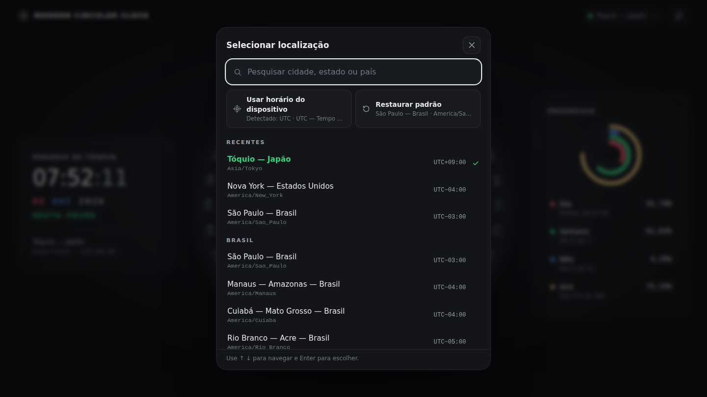

# Modern Circular Clock

Relógio e calendário circular para a web, organizado em **anéis concêntricos**, que mostra a hora e a data de **qualquer localização do mundo**. **São Paulo — Brasil** (`America/Sao_Paulo`) é a localização padrão. Você pode escolher outra cidade, estado, país ou fuso IANA, e **todo o relógio passa a usar essa localização**: ponteiros, data, anéis, progresso, deslocamento UTC, tooltips e título da página.




---

## Sumário

- [Descrição](#descrição)
- [Funcionalidades](#funcionalidades)
- [Fusos horários](#fusos-horários)
- [Localizações disponíveis](#localizações-disponíveis)
- [Pesquisa](#pesquisa)
- [Tecnologias](#tecnologias)
- [Instalação e execução](#instalação-e-execução)
- [Estrutura](#estrutura)
- [Anéis](#anéis)
- [Calendário](#calendário)
- [Cálculo dos ponteiros](#cálculo-dos-ponteiros)
- [Indicadores de progresso](#indicadores-de-progresso)
- [Configurações](#configurações)
- [Responsividade](#responsividade)
- [Acessibilidade](#acessibilidade)
- [Desempenho](#desempenho)
- [Testes](#testes)
- [GitHub Pages](#github-pages)
- [Licença](#licença)

---

## Descrição

Cada anel representa uma grandeza do calendário e **gira** para que o valor atual fique sob uma janela de leitura fixa no topo (12 horas). No centro há um relógio analógico com movimento contínuo, e ao lado ficam a leitura digital e os indicadores de progresso do dia, da semana, do mês e do ano.

A referência temporal é **uma única fonte configurável**: o fuso IANA da localização escolhida. Ele é usado em todos os cálculos, e a localização pode ser trocada a qualquer momento sem recarregar a página.

O projeto usa apenas **HTML5, CSS3, JavaScript moderno (ES2021+, módulos nativos) e SVG**, sem frameworks, sem dependências de execução, sem chaves de API e sem serviços externos.

## Funcionalidades

- **Três anéis concêntricos** (de fora para dentro): dias do mês (`01`–`31`), meses (`JAN`–`DEZ`) e dias da semana (`SEG`–`DOM`).
- Valor atual destacado em cada anel: **dia em vermelho/rosa**, **mês em azul**, **dia da semana em verde**. Itens já transcorridos ficam esmaecidos.
- Os anéis **giram com animação** quando a data muda, seja por uma virada de dia, mês ou ano, seja pela troca para uma localização que já está em outra data.
- O segmento livre de cada anel mostra a **quantidade de dias do mês**, o **ano** e a **semana ISO**.
- **Relógio analógico** com ponteiros em movimento suave (milissegundos incluídos) e o **nome da cidade** no mostrador (`SÃO PAULO`, `TÓQUIO`, `NOVA YORK`). Nomes longos são reduzidos para caber.
- **Relógio digital**: `07:30:01`, `02 OUT 2026`, `SEXTA-FEIRA`, `Horário de Tóquio`, `Tóquio — Japão`, `Asia/Tokyo · UTC+09:00`.
- **Seletor de localização** com pesquisa por cidade, estado, país ou identificador IANA, localizações populares, recentes, "Usar horário do dispositivo" e "Restaurar padrão". O chip no topo (`● São Paulo — Brasil`) é um atalho para ele.
- **Indicadores de progresso** do dia, da semana, do mês e do ano, calculados entre os limites reais do fuso escolhido.
- **Tooltips** ao passar o mouse, tocar ou navegar pelo teclado (ex.: "2 de outubro de 2026 · Sexta-feira · Hoje · Tóquio — Japão").
- **Animação de abertura** de ~1,5 s.
- **Configurações**: localização, tema escuro/claro, 24 h/12 h, Português/English, segundos e indicadores, todas salvas em `localStorage`.
- Atualização contínua: viradas de minuto, hora, dia, mês e ano, e transições de horário de verão, acontecem **sem recarregar a página**.

## Fusos horários

### São Paulo é o padrão, não uma obrigação

Na primeira visita, sem preferência salva, o relógio usa **São Paulo — Brasil** (`DEFAULT_TIME_ZONE = 'America/Sao_Paulo'`). Depois que você escolhe outra localização, essa escolha passa a valer em todo o sistema e é lembrada ao recarregar (F5) ou reabrir o navegador.

### Como trocar a localização

1. Clique no chip do topo (`● São Paulo — Brasil`) ou abra **Configurações → Localização**.
2. Digite uma cidade, estado, país ou identificador: `tóquio`, `japão`, `manaus`, `new york`, `Asia/Tokyo`…
3. Escolha o resultado (clique, toque ou ↑/↓ + Enter).
4. O seletor fecha e o relógio inteiro muda **imediatamente** para o novo fuso.

Também é possível usar o fuso do próprio dispositivo ("Usar horário do dispositivo", que mostra o identificador detectado) ou voltar a São Paulo ("Restaurar padrão").

### Identificadores IANA, nunca offsets fixos

A localização é guardada como um **identificador IANA** (`America/Sao_Paulo`, `Asia/Tokyo`, `America/New_York`, `Europe/London`…). O projeto **não armazena nem soma offsets** como "UTC−3" ou "UTC+9". O deslocamento e as regras de horário de verão de cada data vêm sempre do banco de fusos do ambiente, via `Intl.DateTimeFormat`, porque essas regras mudam com o tempo e de região para região.

**País não é fuso.** Brasil, Estados Unidos, Canadá, México e Austrália têm vários fusos. Por isso a escolha é de uma **localização** (cidade/região), e cada localização aponta para o identificador correto: Manaus → `America/Manaus`, Rio Branco → `America/Rio_Branco`, Cuiabá → `America/Cuiaba`, Fernando de Noronha → `America/Noronha`.

### Como funciona o núcleo multi-fuso

O módulo [`js/zoned-time.js`](js/zoned-time.js) é a **única fonte temporal** do aplicativo:

```js
import { getZonedDateTime, zonedTimeToEpoch } from './js/zoned-time.js';

getZonedDateTime(Date.now(), 'Asia/Tokyo');
// → { timeZone: 'Asia/Tokyo', year: 2026, month: 10, day: 2, hours: 7, minutes: 30,
//     seconds: 1, milliseconds: 250, isoWeekday: 5, isoWeek: 40, dayOfYear: 275,
//     daysInMonth: 31, daysInYear: 365, isLeapYear: false, utcOffsetMinutes: 540,
//     dateKey: '2026-10-02', epochMs: … }

zonedTimeToEpoch({ year: 2026, month: 12, day: 31, hours: 23, minutes: 59 }, 'Asia/Tokyo');
// → o instante absoluto correspondente a 31/12/2026 23:59 em Tóquio
```

1. **O instante** vem de `Date.now()`: um número absoluto, igual em qualquer fuso. **Trocar de localização nunca altera o instante**, só a forma de apresentá-lo.
2. **A conversão** para data e hora civis usa `Intl.DateTimeFormat` com `timeZone` igual ao fuso escolhido. Há **um formatter por zona**, criado uma única vez e guardado em um `Map`.
3. **Um serviço por zona** (`createZonedTimeService` / `getZonedTimeService`) mantém o próprio cache: a consulta ao `Intl` acontece no máximo uma vez por segundo, e os limites de dia/semana/mês/ano só são recalculados quando a data muda. Como os caches são separados por zona, um snapshot de São Paulo **nunca** é reaproveitado para Tóquio.
4. **`zonedTimeToEpoch(civil, timeZone)`** faz o caminho inverso (data civil → instante). Ele é usado para os limites de progresso e para a simulação, e trata transições de horário de verão como o modo *compatible* do Temporal: hora inexistente avança, hora ambígua usa o instante mais cedo.
5. O `app.js` lê `getZonedDateTime(timeSource.now(), settings.timeZone)` a cada quadro. Ao trocar de localização, ele **zera o estado de renderização** (`lastDateKey`, `lastSecond`, offset, título) e redesenha tudo de uma vez, para que valores coincidentemente iguais nunca impeçam a atualização.
6. Nenhum código usa `getHours()`, `getDate()`, `getDay()` ou `getTimezoneOffset()`, e nenhuma função assume um fuso implícito. Sem zona, o núcleo lança um erro em vez de cair silenciosamente no fuso do dispositivo.

### Fuso do dispositivo × fuso selecionado

São coisas diferentes. O **fuso do dispositivo** é como o computador está configurado. O **fuso selecionado** é a localização escolhida no aplicativo, e só ele determina o que o relógio mostra. Com o computador em UTC ou em Nova York e Tóquio selecionado, a tela mostra exatamente o mesmo horário de Tóquio para o mesmo instante. Os testes verificam isso executando a suíte inteira com o "dispositivo" em 8 fusos diferentes.

### Horário de verão (DST)

Para fusos com horário de verão (Nova York, Londres, Paris, Sydney…), tudo segue as regras reais da data:

- o deslocamento UTC exibido muda no momento exato da transição. Ele é verificado a cada segundo, não só na troca de data, porque em Nova York a mudança acontece às 02:00;
- os limites do dia são meias-noites reais, então um dia pode ter **23, 24 ou 25 horas**, e o progresso do dia é medido sobre a duração verdadeira;
- a conversão civil → instante trata horas inexistentes e ambíguas.

### Validação e fallback

- Toda zona salva é validada com `new Intl.DateTimeFormat('en-US', { timeZone })`. Uma zona inválida ou não suportada pelo navegador volta para **São Paulo**, e uma mensagem discreta avisa o usuário.
- O seletor só oferece zonas que o navegador suporta. Grafias antigas (`Europe/Kiev`, `Asia/Calcutta`) são reconhecidas como equivalentes às atuais.
- Antes de carregar o aplicativo, um pequeno script verifica se o navegador resolve fusos IANA (a zona salva ou a padrão). Se não resolver, a página explica o problema em vez de mostrar um horário errado.

### Armazenamento local

As preferências ficam em `localStorage`, na chave `modern-circular-clock:settings`:

```json
{
  "theme": "dark",
  "hourFormat": "24",
  "language": "pt",
  "showSeconds": true,
  "showProgress": true,
  "timeZone": "Asia/Tokyo",
  "location": "tokyo"
}
```

- `timeZone` é a referência de todos os cálculos. `location` é opcional e só escolhe o **nome exibido** entre lugares que compartilham uma zona (São Paulo, Rio de Janeiro e Brasília usam `America/Sao_Paulo`).
- **Migração transparente:** configurações salvas antes desta versão (sem `timeZone`) mantêm todas as outras preferências e recebem `America/Sao_Paulo`.
- As **localizações recentes** (até 5) ficam em `modern-circular-clock:recent-locations`.

### Limitações honestas

- O navegador **não tem acesso independente a um relógio atômico**. O instante atual depende do relógio do sistema operacional, normalmente sincronizado por NTP, e um relógio adiantado ou atrasado leva o mesmo erro para a tela. O **fuso**, porém, estará sempre correto.
- As regras de fuso vêm do banco IANA embutido no navegador, e um navegador desatualizado pode não conhecer mudanças muito recentes de algum país.
- Zonas fora do catálogo curado aparecem com um nome derivado do identificador (ex.: `Ushuaia — Argentina — Américas`).

## Localizações disponíveis

O catálogo curado ([`js/locations.js`](js/locations.js)) tem **91 lugares** com nomes em Português e English. Ele contém apenas nome, região, país e identificador IANA, nunca offsets.

| Grupo | Exemplos (populares em negrito) |
| --- | --- |
| Brasil | **São Paulo**, **Manaus**, **Cuiabá**, **Rio Branco**, **Fernando de Noronha**, Rio de Janeiro, Brasília, Belo Horizonte, Curitiba, Porto Alegre, Salvador, Recife, Fortaleza, Belém, Porto Velho, Boa Vista, Campo Grande |
| América do Norte | **Nova York**, **Chicago**, **Denver**, **Los Angeles**, **Toronto**, **Vancouver**, **Cidade do México**, Phoenix, Anchorage, Honolulu, Halifax, St. John's |
| América Latina | Buenos Aires, Santiago, Montevidéu, Assunção, La Paz, Lima, Bogotá, Caracas, Cidade do Panamá, Havana |
| Europa | **Londres**, **Lisboa**, **Madri**, **Paris**, **Berlim**, **Roma**, **Moscou**, Dublin, Bruxelas, Amsterdã, Zurique, Viena, Estocolmo, Varsóvia, Atenas, Kiev, Istambul |
| África | Cairo, Casablanca, Lagos, Luanda, Nairóbi, Joanesburgo, Maputo |
| Ásia | **Dubai**, **Nova Délhi**, **Bangkok**, **Singapura**, **Hong Kong**, **Pequim**, **Seul**, **Tóquio**, Jerusalém, Riad, Teerã, Karachi, Mumbai, Katmandu, Daca, Jacarta, Ho Chi Minh, Xangai, Taipé, Manila |
| Oceania | **Perth**, **Sydney**, **Melbourne**, **Auckland**, Adelaide, Brisbane, Suva |
| Outros | UTC |

Além do catálogo, **todos os fusos que o navegador suporta** (`Intl.supportedValuesOf('timeZone')`, mais de 400) podem ser pesquisados. Quando essa função não existe, o catálogo curado funciona sozinho como fallback.

## Pesquisa

- **Ignora acentos e maiúsculas:** `japao` encontra "Japão", e `sao paulo` encontra "São Paulo".
- **Procura em todos os campos e nos dois idiomas:** cidade, estado/região, país, palavras-chave e identificador IANA (`tokyo` e `tóquio` dão o mesmo resultado).
- **Todas as palavras digitadas precisam aparecer.**
- **Ordenação:** cidade exata → estado/país exato (`brasil`, `japão`) → início do nome da cidade → identificador (`asia/tokyo`) → início de palavra → qualquer posição. Nos empates, lugares populares vêm primeiro.
- **Com o campo vazio:** aparecem as localizações recentes e as populares por região.

| Pesquisa | Primeiro resultado |
| --- | --- |
| `tokyo`, `tóquio`, `japão`, `Asia/Tokyo` | Tóquio — Japão · `Asia/Tokyo` |
| `manaus`, `amazonas` | Manaus — Amazonas — Brasil · `America/Manaus` |
| `new york`, `nova york` | Nova York — Estados Unidos · `America/New_York` |
| `brasil` | São Paulo, Manaus, Cuiabá, Rio Branco, Fernando de Noronha… |
| `kolkata`, `delhi` | Nova Délhi — Índia · `Asia/Kolkata` |

## Tecnologias

| Tecnologia | Uso |
| --- | --- |
| HTML5 | Estrutura semântica, `<dialog>`, `<time datetime>` |
| CSS3 | Custom properties (temas), Grid, Flexbox, `clamp()`/`min()`/`max()`, container queries, `dvh`, `prefers-reduced-motion`, `forced-colors` |
| JavaScript ES2021+ | Módulos nativos, `Intl.DateTimeFormat` (com `timeZone`), `Intl.supportedValuesOf`, `Intl.NumberFormat`, `requestAnimationFrame`, `visualViewport` |
| SVG | Anéis, mostrador, ponteiros e indicadores de progresso |
| Node.js `node:test` | Testes automatizados (sem dependências) |

O projeto não usa React, Angular, Vue, jQuery nem nenhum pacote npm. O `package.json` serve apenas para os scripts de teste.

## Instalação e execução

Não há nada para instalar. Como o projeto usa **módulos ES**, ele precisa ser servido por HTTP: abrir o `index.html` direto pelo sistema de arquivos (`file://`) é bloqueado pelos navegadores.

```bash
git clone https://github.com/Helio965/Modern-Web-Clock.git
cd Modern-Web-Clock

# Opção 1 — Python 3
python -m http.server 8000      # ou: python3 -m http.server 8000

# Opção 2 — Node.js
npx serve .
```

Depois, abra `http://localhost:8000` (ou o endereço indicado pelo `serve`).

## Estrutura

```text
/
├── index.html              Página única (mostrador, painéis, configurações, seletor de localização)
├── css/
│   ├── style.css           Tokens de design, temas, layout, painéis, diálogos, seletor, tooltip
│   ├── clock.css           Mostrador, anéis, ponteiros e animação de abertura
│   └── responsive.css      Layouts por tamanho de tela, seletor em tela cheia no celular, movimento reduzido, alto contraste
├── js/
│   ├── zoned-time.js       Núcleo temporal multi-fuso: única fonte de data/hora para qualquer zona IANA
│   ├── locations.js        Catálogo de localizações (pt/en), pesquisa, fusos do navegador, fuso do dispositivo
│   ├── location-picker.js  Seletor de localização (combobox + listbox em <dialog>)
│   ├── settings.js         Preferências (localStorage): tema, formato, idioma, exibição, timeZone, recentes
│   ├── time-source.js      Origem do instante: relógio real ou simulação via URL (interpretada no fuso escolhido)
│   ├── app.js              Inicialização e laço de renderização (requestAnimationFrame)
│   ├── calendar.js         Anéis de dias do mês, meses e dias da semana
│   ├── clock.js            Ponteiros analógicos, nome da cidade no mostrador e leitura digital
│   ├── progress.js         Indicadores de progresso (dia, semana, mês, ano)
│   ├── tooltip.js          Conteúdo dos tooltips e exploração por teclado
│   └── i18n.js             Textos em Português/English e formatação
├── tests/
│   ├── *.test.js           Testes unitários (node:test)
│   └── run-timezones.js    Executa a suíte com o "dispositivo" em 8 fusos
├── assets/
│   ├── favicon.svg
│   ├── preview.png         Capturas usadas neste README
│   └── preview-locations.png
├── .github/workflows/
│   └── tests.yml           CI: testes em vários fusos a cada pull request
├── package.json            Apenas scripts (sem dependências)
├── README.md
├── LICENSE
└── .gitignore
```

## Anéis

O mostrador é um SVG com `viewBox` de 1000 × 1000:

| Anel | Raio | Itens | Passo angular | Segmento livre mostra |
| --- | --- | --- | --- | --- |
| Dias do mês | 445 | 28–31 | 10° | quantidade de dias (`31 DIAS`) |
| Meses | 365 | 12 | 25° | o ano (`2026`) |
| Dias da semana | 285 | 7 | 40° | a semana ISO (`SEM 40`) |

- Os itens têm **passo fixo**, então um mês curto deixa um segmento livre maior.
- Cada anel gira em `-(índice × passo)` graus para levar o valor atual à **janela de leitura** no topo. A rotação é **cumulativa**: de 31 para 01 o anel avança pelo segmento livre em vez de voltar.
- O DOM dos anéis é criado **uma única vez**. Na troca de data (ou de localização), só mudam classes, alguns rótulos e um `transform` por anel.

## Calendário

- **Dias do mês**: `daysInMonth(ano, mês)` aplica a regra gregoriana de anos bissextos. Fevereiro tem 28 ou 29 dias conforme o ano, sem nada fixo no código.
- **Dia da semana, dia do ano e semana ISO** são calculados sobre a data civil **do fuso escolhido**, com aritmética UTC (neutra em relação ao fuso).
- Na virada de mês, o anel de dias esconde ou mostra os dias 29–31, redimensiona o segmento livre e gira até o dia 01. Na virada de ano, o anel de meses avança de DEZ para JAN e o ano é atualizado.

## Cálculo dos ponteiros

Ângulos em graus (0° = 12 horas, sentido horário), calculados de forma contínua a partir do snapshot do fuso escolhido:

```text
s = segundos + milissegundos / 1000
segundos = s × 6
minutos  = minutos × 6 + s × 0,1
horas    = (horas mod 12) × 30 + minutos × 0,5 + s / 120
```

As fórmulas não dependem do fuso. Só o snapshot que as alimenta muda quando a localização é trocada. Com `prefers-reduced-motion: reduce`, o ponteiro dos segundos avança uma vez por segundo.

## Indicadores de progresso

Cada indicador é a fração já transcorrida entre os **limites reais do período no fuso escolhido**:

```text
progresso = (agora − início) / (fim − início)
```

| Indicador | Início | Fim |
| --- | --- | --- |
| Dia | 00:00 de hoje | 00:00 de amanhã |
| Semana | segunda-feira 00:00 | segunda-feira seguinte 00:00 |
| Mês | dia 1 às 00:00 | dia 1 do mês seguinte às 00:00 |
| Ano | 1º de janeiro às 00:00 | 1º de janeiro do ano seguinte às 00:00 |

- Os limites são instantes absolutos obtidos com `zonedTimeToEpoch(civil, timeZone)` e cacheados por zona e por data.
- O cálculo usa milissegundos: ao meio-dia local o dia está em **50%** em qualquer fuso, e em um dia de 23 h ou 25 h (horário de verão) o progresso usa a duração verdadeira.
- Se no mesmo instante São Paulo ainda está em 01/10 e Tóquio já está em 02/10, cada um mostra o próprio progresso.

## Configurações

O botão no canto superior direito abre o painel. O chip de localização abre diretamente o seletor.

| Opção | Valores | Padrão |
| --- | --- | --- |
| Localização | qualquer cidade/fuso IANA; recentes; usar horário do dispositivo; restaurar padrão | **São Paulo — Brasil** (`America/Sao_Paulo`) |
| Tema | Escuro / Claro | Escuro |
| Formato | 24h / 12h (AM/PM) | 24h |
| Idioma | Português / English (inclui os nomes das localizações) | Português |
| Segundos | Mostrar / Ocultar | Mostrar |
| Indicadores de progresso | Mostrar / Ocultar | Mostrar |

Mudar tema, formato ou idioma não altera a localização. Mudar a localização não altera as outras preferências.

## Responsividade

O relógio é sempre o maior quadrado que cabe no espaço livre (`clamp()`, `min()`, `max()`, `dvh`):

| Tela | Layout |
| --- | --- |
| Desktop (≥ 1180 px, paisagem), ex.: 1920×1080 e 1366×768 | digital · relógio · progresso, sem rolagem |
| Tablet em paisagem / notebook pequeno (≥ 800 px) | relógio + coluna lateral com os painéis |
| Tablet em retrato (≥ 600 px) | relógio em cima, painéis lado a lado embaixo |
| Smartphone | relógio na largura da tela, painéis abaixo |

O **seletor de localização** é um diálogo centralizado no desktop e ocupa **a tela inteira no celular**. A altura dele acompanha o `visualViewport`, de modo que o teclado virtual não esconde os resultados. O campo usa fonte de 16 px para evitar zoom automático no iOS. Nomes longos são abreviados com reticências no chip e reduzidos no mostrador ("FERNANDO DE NORONHA").

## Acessibilidade

- **Seletor de localização**: campo `role="combobox"` com `aria-expanded`, `aria-controls` e `aria-activedescendant` sobre um `role="listbox"` com opções `aria-selected`. As teclas são ↑/↓ (navegar), Enter (escolher), Esc (fechar) e Tab (navegação normal). A quantidade de resultados é anunciada em uma região `aria-live`, e o foco volta ao botão que abriu o seletor.
- **Teclado nos anéis**: `Tab` chega aos anéis e às linhas de progresso. `←`/`→`, `Home` e `End` exploram os itens, e `Esc` fecha o tooltip.
- **Leitores de tela**: rótulos dinâmicos ("Relógio circular no horário de Tóquio", "Alterar localização (atual: Tóquio — Japão)"), indicadores `role="progressbar"` e hora digital em `<time datetime="2026-10-02T07:30:01+09:00">`.
- **Foco visível** em todos os controles, `prefers-reduced-motion`, `forced-colors`, contraste adequado nos dois temas e `lang` do documento atualizado conforme o idioma.

## Desempenho

- **Atualizações separadas por frequência**: ponteiros a cada quadro, leitura digital, offset e progresso uma vez por segundo, anéis e data somente quando a data muda (ou a localização).
- **Um `Intl.DateTimeFormat` por zona**, cacheado, e no máximo **uma consulta ao `Intl` por segundo** por zona. Os limites de período são cacheados por zona e data.
- A lista completa de fusos é montada sob demanda, na primeira pesquisa, e a pesquisa sobre mais de 400 localizações leva menos de 1 ms.
- Um único `requestAnimationFrame`, sem `setInterval` concorrentes.

## Testes

Os testes usam o executor nativo do Node.js (`node:test`), sem instalar nada (Node.js ≥ 20):

```bash
npm test           # suíte completa (98 testes)
npm run test:tz    # a mesma suíte com o "dispositivo" em 8 fusos
```

`npm run test:tz` executa a suíte com `TZ` igual a `America/Sao_Paulo`, `UTC`, `America/New_York`, `Europe/London`, `Asia/Tokyo`, `Asia/Kolkata`, `Pacific/Kiritimati` (UTC+14) e `Pacific/Pago_Pago` (UTC−11). Como os testes afirmam resultados fixos para cada **fuso selecionado**, a suíte passando em todos os fusos de **dispositivo** prova que um não interfere no outro.

A suíte cobre, entre outros pontos:

- **Mesmo instante em várias zonas:** horários civis diferentes em São Paulo, Nova York, Los Angeles, Londres, Paris, Tóquio, Kolkata, Sydney e Katmandu (UTC+05:45), todos apontando de volta para o mesmo instante.
- **Datas diferentes ao mesmo tempo:** São Paulo em 01/10 (quinta) enquanto Tóquio já está em 02/10 (sexta). dateKey, anel do dia, dia da semana e progresso diferem.
- **Troca de fuso:** São Paulo → Tóquio no mesmo segundo devolve um snapshot de Tóquio (caches isolados por zona).
- **Horário de verão:** Nova York (hora inexistente e hora ambígua), Londres e Sydney, com dias de 23 h e 25 h e o progresso do dia correspondente.
- **Viradas e calendário:** `23:59:58 → 00:00:01` em 31/10, 31/12, 28/02, 29/02 (2028) e 30/04, anos bissextos e semana ISO.
- **Configurações:** padrão São Paulo, zona válida preservada, zona inválida → padrão, migração de configurações antigas, persistência (F5), outras preferências preservadas e recentes.
- **Localizações:** pesquisa (`tokyo`, `japão`, `manaus`, `new york`, `Asia/Tokyo`), aliases, nomes pt/en, fallback sem `Intl.supportedValuesOf` e fuso do dispositivo.
- **Simulação:** interpretação no fuso escolhido, troca de localização durante a simulação e travessia de horário de verão.

### Simulação de datas no navegador

Para ver uma virada sem esperar a data chegar, use parâmetros na URL. O valor é uma **data/hora civil no fuso selecionado**, e um selo "Simulação" aparece no topo:

```text
http://localhost:8000/?sim=2026-12-31T23:59:55            # virada de ano na localização escolhida
http://localhost:8000/?sim=2028-02-28T23:59:50&speed=10   # 29/02 em ano bissexto, 10× mais rápido
http://localhost:8000/?sim=2026-03-08T01:59:55            # com Nova York selecionada: 01:59 → 03:00 (horário de verão)
```

Com Tóquio selecionado, `?sim=2026-12-31T23:59:50` significa 23:59:50 de 31/12 **em Tóquio**. Se você trocar a localização durante a simulação, o ponto de partida é **reinterpretado no novo fuso, preservando o tempo simulado já decorrido**: uma simulação que mostrava 23:59:55 em São Paulo passa a mostrar 23:59:55 em Tóquio, sem salto para um momento sem relação. Sem o parâmetro `sim`, o relógio real é usado.

## GitHub Pages

O projeto é estático e usa apenas caminhos relativos, então funciona no GitHub Pages sem nenhuma etapa de build (o arquivo `.nojekyll` desativa o processamento Jekyll, que é desnecessário aqui).

Para publicar:

1. No repositório, abra **Settings → Pages**.
2. Em **Build and deployment → Source**, escolha **Deploy from a branch**.
3. Selecione a branch **`main`** e a pasta **`/ (root)`** e clique em **Save**.
4. Aguarde a publicação. O endereço aparece na própria página de configurações do Pages.

## Licença

Distribuído sob a licença MIT. Veja [LICENSE](LICENSE).
